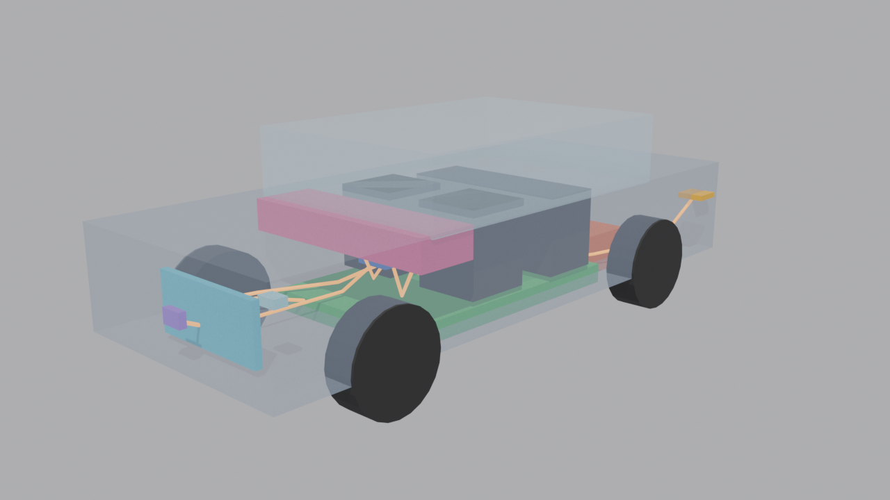

# Project SysML Car

An interactive, clickable electric car that shows how systems-engineering traceability works, built from a real SysML requirements model.

## Live Demo

Explore the car yourself: https://wallysoftdevlol.github.io/Project-SysML-Car/



## What You Can Do

- **Click a part** to see the requirements it fulfills, where they came from, and which tests prove them work.
- **Select a requirement** to highlight all the parts responsible for it.
- **Explode view** to pull the subsystems apart so you can see how they sit in the car.
- **X-ray mode** to look through the body shell at the battery, motors, controller and wiring.
- **Toggle plain language vs. SysML terms** (Satisfy, Verify, Derive) depending on your audience.
- **Guided tour** to learn the model through a narrative flow.

## Why This Exists

**Traceability** is a chain: stakeholder need → system requirement → subsystem requirement → part → test. It's how complex systems stay together.

Without it, you forget requirements, changes break downstream work, and nobody knows if something was actually tested. This tool makes that invisible chain visible: click a part, see exactly what it promises to do and how we prove it. Designed for engineering teams, consultants, and anyone curious about how systems are actually built.

## The Model in Numbers

| Metric | Count |
|--------|-------|
| Requirements | 59 (+8 verification copies) |
| Trace relationships | 207 (Satisfy 68, Verify 67, Derive 51, Refine 7, Trace 6, Copy 8) |
| Parts | 13 |
| Test cases | 18 |
| Use cases | 7 |
| Data / power flows | 9 |

## How It Is Built

```
Cameo model script (.groovy)
    ↓  (tools/model_script_to_json.py)
data/model.json
    ↓  (Blender 5.2 headless script)
dist/car.glb
    ↓  (Vite + TypeScript + three.js)
GitHub Pages
```

1. **Model script** (`data/source/*.groovy`) — a Cameo `modelScript('''<JSON>''')` export: every requirement, block, port, connector, activity, state machine, sequence diagram and parametric in one semantic JSON document. This is the source of truth. The companion Excel workbook (`data/source/*.xlsx`) is a derived export of just the requirement/relationship subset, kept only as a reference/cross-check (`tools/xlsx_to_json.py` still converts it, and `tests/test_model_script_to_json.py` asserts the two converters agree on every field the workbook covers).
2. **Data layer** (`tools/model_script_to_json.py` → `data/model.json`) — Converts the model script to typed JSON, including behavior (state machines, activities, sequence diagrams) and parametrics that the workbook alone can't express. Committed to repo.
3. **3D model** (`model/build_car.py` → `dist/car.glb`) — Blender Python script builds the car mesh programmatically, no hand modeling.
4. **Viewer** (`web/` → GitHub Pages) — Vite + three.js interactive viewer.

Outputs are deterministic: rebuilding produces byte-identical files, so you can verify no corruption or hidden changes snuck in.

## Run It Yourself

**Prerequisites:**
- Blender 5.2.1 LTS
- Node 24
- Python 3.12+ with `openpyxl`

**Full pipeline** (model script → model.json → glb → preview):
```powershell
.\tools\build_local.ps1
```

**Just the web viewer** (if you only want to iterate on the UI):
```powershell
cd web
npm install
npm run dev          # http://localhost:5173
npm run test:unit
npm run test:e2e
npm run build
```

The GLB asset is committed, so you can develop the viewer without Blender installed.

## Repository Map

- `data/` — Cameo model script, requirements workbook (reference export), model JSON (generated), and block catalog.
- `model/` — Blender Python scripts: entry point `build_car.py`, layout math, one module per subsystem.
- `web/` — Vite + TypeScript viewer: scene, state, UI, tests.
- `docs/` — Model contract, preview image.
- `tools/` — Data converter, GLB validator, build orchestration script.
- `tests/` — Python tests for the converter and the GLB validator (web tests live in `web/tests/`).
- `dist/` — Generated GLB and build report (committed).
- `.github/workflows/` — CI: model verification and Pages deployment.

## Data Contract

The model.json schema is the source of truth for all consumers (Blender builder, web viewer, validators). See `docs/model-contract.md` for:
- Block catalog structure (`data/blocks.json`)
- Element and relationship types
- glTF node naming and metadata conventions
- Color palette
- Plain-language mappings

Node names must equal SysML External IDs; IDs are stable across rebuilds.

## License

No license has been chosen yet; all rights reserved by the author until one is added.
